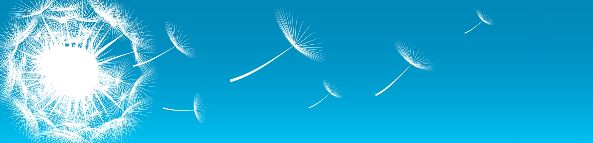

:css: assets/css/docker_presentation.css
:title: Docker présentation
:author: Christophe Brun
:event: Interne
:description: Openwide
:data-transition-duration: 1300
:pygments: monokai

----

:id: homepage

Docker / Dockerfiles / Fig
==========================

Christophe Brun
---------------

----

:id: sommaire_joomla_15

Docker / Dockerfiles / Fig
==========================

Sommaire
--------

Introduction
~~~~~~~~~~~~

----

:id: introduction

Introduction
============

* Docker est une solution Open Source de développement, déploiement, et exécution d'application.
* Son but principal est de simplifier le déploiement d'application quelque soit l'infrastructure utilisé.
* La vision est plus infrastructure qu'applicative.
* Docker est basé sur LXC : Exécution d'application dans un container isolé sur une machine hôte.
* Terminologie :
    * Container : c'est la partie exécutable de l'application. Cet une "instance" d'une image
    * Image : Ce sont des "template" d'application. Utilisé pour créer des container. Sont en lecture seule
    * Layer : Ce sont les couces nécessaire à la création d'une image : Couche OS, couche Apache ...
    * Registry : Entrepôt d'images

----

:id: vm_vs_container

VMs / Containers
================

* Les VM sont isolées au niveau OS
* Les containers partagent l'OS hôte et sont isolés lors de l'exécution

.. image:: assets/img/Docker-technology.png

----

:

